## {background-color="#43e911"}

::: {.container-aviso}
::: {.aviso-fullscreen}
**Dica para Celular:** Para melhor visualização, coloque o celular no modo horizontal.
Clique no **Menu (☰)** → **Tools** → **Fullscreen**.
:::
:::

---

## [Exercício 1: Transformada de Fourier Discreta]{style="color: #f1da08; text-align: center; display: block;font-size: 1em;"} {background-color="#000000"}

::: {#lousa-senai}

::: {.fragment .escrita-estavel style="color: #00eeff; font-family: 'Courier New', monospace; font-size: 1.5em;"}
Considere a equação de diferença $y[n] - y[n-1] +0,25y[n-2] = x[n]$. Determine:

 * A Função de transferência.
 * A resposta ao impulso.
 * Analise a estabilidade e Causalidade.

:::

::: {.fragment style="color: #43e911; font-family: 'Courier New', monospace; font-size: 1.5em;"}
Cálculo da função de transferência:
:::

::: {.fragment style="font-size: 1.5em;"}
$$\displaystyle Y[e^{j\omega}] - e^{-j\omega}Y[e^{j\omega}] + 0,25e^{-j2\omega}Y[e^{j\omega}] = X[e^{j\omega}]$$
:::

::: {.fragment style="font-size: 1.5em;"}
$$\displaystyle Y[e^{j\omega}] [1 - e^{-j\omega} + 0,25e^{-j2\omega}] = X[e^{j\omega}]$$
:::

::: {.fragment style="font-size: 1.5em;"}
$$\displaystyle \dfrac{Y[e^{j\omega}]}{X[e^{j\omega}]} =  \dfrac{1}{1 - e^{-j\omega} + 0,25e^{-j2\omega}}$$
:::

::: {.fragment style="font-size: 1.5em;"}
$$\displaystyle H[e^{j\omega}] =  \dfrac{1}{1 - e^{-j\omega} + 0,25e^{-j2\omega}}$$
:::

::: {.fragment style="font-size: 1.5em;"}
$$\displaystyle H[e^{j\omega}] =  \dfrac{1}{0,25\left(\dfrac{1}{0,25} - \dfrac{e^{-j\omega}}{0,25} + e^{-j2\omega}\right)}$$
:::

::: {.fragment style="font-size: 1.5em;"}
$$\displaystyle H[e^{j\omega}] =  \dfrac{4}{4 - 4e^{-j\omega} + e^{-j2\omega}}$$
:::

::: {.fragment style="border: 2px solid #f1da08; border-radius: 15px; margin: 20px auto; padding: 20px; width: 90%; box-sizing: border-box;"}
[**Cálculo Auxiliar: fatoração do polinômio do denominador**]{style="color: #08e9f1; font-family: 'Courier New', monospace;font-size: 1.3em; display: block; margin-bottom: 10px;"}

::: {.fragment style="font-size: 1.5em;"}
$$\displaystyle  e^{-j2\omega} - 4e^{-j\omega} + 4$$
:::

::: {.fragment style="font-size: 1.5em;"}
$$\displaystyle (e^{-j\omega} - 2)^2 - 4  + 4$$
:::

::: {.fragment style="font-size: 1.5em;"}
$$\displaystyle (e^{-j\omega} - 2)^2$$
:::
:::

::: {.fragment .escrita-estavel style="color: #00eeff; font-family: 'Courier New', monospace; font-size: 1.5em;"}
Logo teremos por frações parciais:
:::

::: {.fragment style="font-size: 1.5em;"}
$$\displaystyle \dfrac{4}{(e^{-j\omega} - 2)^2} =  \dfrac{A}{e^{-j\omega} - 2} + \dfrac{B}{(e^{-j\omega} - 2)^{2}}$$
:::

::: {.fragment style="font-size: 1.1em;"}
$$\displaystyle \dfrac{4}{[-2(-0,5e^{-j\omega} + 1)]^{2}} =  \dfrac{A}{-2(-0,5e^{-j\omega} + 1)} + \dfrac{B}{[-2(-0,5e^{-j\omega} + 1)]^{2}}$$
:::

::: {.fragment style="font-size: 1.2em;"}
$$\displaystyle \dfrac{1}{(1 - 0,5e^{-j\omega})^{2}} =  -0,5\dfrac{A}{(1 - 0,5e^{-j\omega})} -0,5\dfrac{B}{(1 - 0,5e^{-j\omega})^{2}}$$
:::

::: {.fragment style="border: 2px solid #f1da08; border-radius: 15px; margin: 20px auto; padding: 20px; width: 90%; box-sizing: border-box;"}
[**Neste caso, as frações parciais apresentam o mesmo denominador com potências distintas. Portanto, é necessário derivar a equação para determinar o valor de A.**]{style="color: #08e9f1; font-family: 'Courier New', monospace;font-size: 1.3em; display: block; margin-bottom: 10px;"}
:::

::: {.fragment style="border: 2px solid #f1da08; border-radius: 15px; margin: 20px auto; padding: 20px; width: 90%; box-sizing: border-box;"}
[**Vamos primeiro encontar o valor da constante B.O denominador de B igualando a zero,encontramos:**]{style="color: #08e9f1; font-family: 'Courier New', monospace;font-size: 1.3em; display: block; margin-bottom: 10px;"}

::: {.fragment style="font-size: 1.5em;"}
$$\displaystyle 1-0,5e^{-jw} = 0$$
:::

::: {.fragment style="font-size: 1.5em;"}
$$\displaystyle e^{-jw} = 2$$
:::

:::

::: {.fragment style="border: 2px solid #f1da08; border-radius: 15px; margin: 20px auto; padding: 20px; width: 90%; box-sizing: border-box;"}
[**Agora multiplicamos todos os numeradores pelo fator:**]{style="color: #08e9f1; font-family: 'Courier New', monospace;font-size: 1.3em; display: block; margin-bottom: 10px;"}

::: {.fragment style="font-size: 1.5em;"}
$$\displaystyle (1 - 0,5e^{-j\omega})^{2}$$
:::

:::

::: {.fragment style="font-size: 1.5em;"}
$$\displaystyle 1 = -0,5A(1 - 0,5e^{-j\omega}) - 0,5B$$
:::

::: {.fragment style="border: 2px solid #f1da08; border-radius: 15px; margin: 20px auto; padding: 20px; width: 90%; box-sizing: border-box;"}
[**Lembrando que:**]{style="color: #08e9f1; font-family: 'Courier New', monospace;font-size: 1.3em; display: block; margin-bottom: 10px;"}

::: {.fragment style="font-size: 1.5em;"}
$$\displaystyle e^{-jw} = 2$$
:::

:::

::: {.fragment style="font-size: 1.5em;"}
$$\displaystyle 1 =  - 0,5B \longrightarrow B = -2$$
:::

::: {.fragment .escrita-estavel style="color: #00eeff; font-family: 'Courier New', monospace; font-size: 1.5em;"}
Para encontrar a constante A, derivamos a equação: $1 = -0,5A(1 - 0,5e^{-j\omega}) - 0,5B$
:::

::: {.fragment style="font-size: 1.5em;"}
$$\displaystyle 0 = 0,25A \longrightarrow A = 0$$
:::

::: {.fragment .escrita-estavel style="color: #00eeff; font-family: 'Courier New', monospace; font-size: 1.5em;"}
Assim temos que: 
:::

::: {.fragment style="font-size: 1.5em;"}
$$\displaystyle H[e^{jw}] = \dfrac{1}{(1 - 0,5e^{-j\omega})^{2}}$$
:::

::: {.fragment style="border: 2px solid #f1da08; border-radius: 15px; margin: 20px auto; padding: 20px; width: 90%; box-sizing: border-box;"}
[**Lembrando que:**]{style="color: #08e9f1; font-family: 'Courier New', monospace;font-size: 1.3em; display: block; margin-bottom: 10px;"}

::: {.fragment style="font-size: 1.5em;"}
$$\displaystyle \dfrac{(n+r-1)!}{n! (r-1)!}a^{(n - n_{0})}u[n-n_{0}] = \dfrac{e^{-j\omega n_{0}}}{(1-ae^{-j\omega})^{r}}$$
:::

:::

::: {.fragment style="border: 2px solid #d608f1; border-radius: 15px; margin: 20px auto; padding: 20px; width: 90%; box-sizing: border-box;"}
[**Então a resposta ao impulso será:**]{style="color: #08e9f1; font-family: 'Courier New', monospace;font-size: 1.3em; display: block; margin-bottom: 10px;"}

::: {.fragment style="font-size: 1.5em;"}
$$\displaystyle h[n] = (n+1)(0,5)^{n}u[n]$$
:::

:::

::: {.fragment .escrita-estavel style="color: #00eeff; font-family: 'Courier New', monospace; font-size: 1.5em;"}
Como a soma de todos os valores de $h[n]$ é positiva e não há alternância de sinal que gere cancelamento DC, concluímos que o sistema atua como um **Filtro Passa-Baixas**.
:::

::: {.fragment .escrita-estavel style="color: #00eeff; font-family: 'Courier New', monospace; font-size: 1.5em;"}
[**Visualização da Resposta ao Impulso:**]{style="color: #43e911; display: block; margin-top: 20px;"}

{width=80%}

:::

::: {.fragment}
:::

:::
